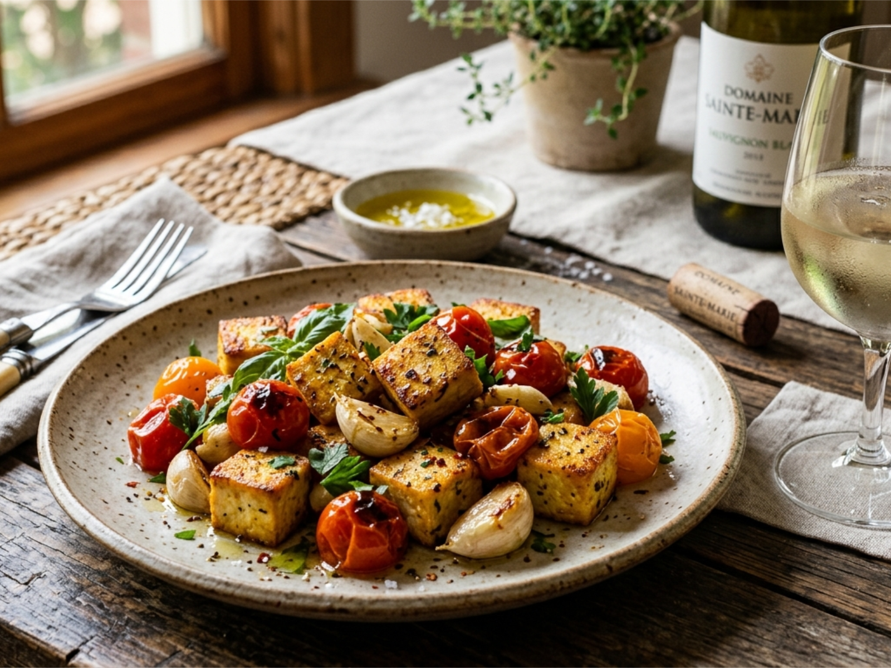

# 마늘 두부 토마토 볶음

> ⏱️ 조리시간: 12분 | 🍽️ 1인분 | 난이도: ⭐ 쉬움 | 🔥 약 250kcal

## 📝 재료

**필수 재료**
- 두부 (단단한 부침용) — 1/2모 (150g)
- 방울토마토 — 10~12알
- 마늘 — 3쪽

**양념 (기본 보유 재료)**
- 간장 — 1큰술
- 설탕 — 1/2작은술
- 식용유 — 1큰술
- 소금, 후추 — 약간

**선택 재료**
- 대파 또는 쪽파 — 조금 (없어도 OK)
- 참기름 — 1/2작은술 (마무리용)

## 👨‍🍳 만드는 법

1. **두부 준비**: 두부를 키친타월로 눌러 물기를 제거한 뒤, 먹기 좋은 크기(2~3cm)로 깍둑 썬다. 마늘은 편으로 썰거나 다진다.

2. **두부 굽기**: 프라이팬에 식용유를 두르고 중강불로 달군 뒤, 두부를 넣어 앞뒤로 노릇하게 2~3분씩 굽는다. 젓가락보다 뒤집개를 쓰면 부서지지 않아요!

3. **마늘 볶기**: 두부를 팬 가장자리로 밀고, 빈 가운데에 마늘을 넣어 30초간 향이 나도록 볶는다.

4. **토마토 추가**: 방울토마토를 통째로 넣고 30초~1분 볶아 껍질이 살짝 터지게 한다. 토마토가 부드럽게 으깨지면 더 맛있어요.

5. **양념 마무리**: 간장 1큰술, 설탕 1/2작은술을 넣고 전체를 잘 섞어 1분간 더 볶는다. 불을 끄고 참기름을 살짝 뿌리면 완성!

## 💡 꿀팁

- **설거지 최소화**: 도마 대신 두부 포장지 위에서 바로 칼로 썰면 도마 설거지가 없어요.
- **더 맛있게**: 두부는 꼭 물기를 제거해야 기름이 덜 튀고 바삭하게 구워져요.
- **재료 대체**: 방울토마토 대신 일반 토마토 1/2개를 큼직하게 썰어도 OK.
- **밥과 함께**: 남은 소스에 밥을 볶아 먹으면 초간단 볶음밥이 돼요!
- **매콤하게**: 고추장 1/2작은술 또는 고춧가루를 추가하면 칼칼한 맛이 살아나요.

## 🔥 칼로리 정보
| 재료 | 칼로리 |
|------|--------|
| 두부 1/2모 (150g) | 약 120kcal |
| 방울토마토 10~12알 | 약 30kcal |
| 마늘 3쪽 | 약 10kcal |
| 간장 1큰술 | 약 10kcal |
| 식용유 1큰술 | 약 45kcal |
| 설탕 1/2작은술 | 약 8kcal |
| 참기름 1/2작은술 | 약 20kcal |
| **합계** | **약 250kcal** |

## 🍺 페어링 추천
- **화이트 와인**: 소비뇽 블랑 — 토마토의 산미와 두부의 담백함에 상큼한 화이트 와인이 찰떡이에요!
- **맥주**: 벨지안 밀맥주 (호가든) — 부드러운 거품이 마늘 향과 잘 어울려요.
- **하이볼**: 자몽 하이볼 — 토마토의 새콤함과 자몽의 상큼함이 시너지를 내요.
- **비알콜**: 레몬 스파클링워터 — 가볍고 깔끔하게 입안을 정리해줘요.
