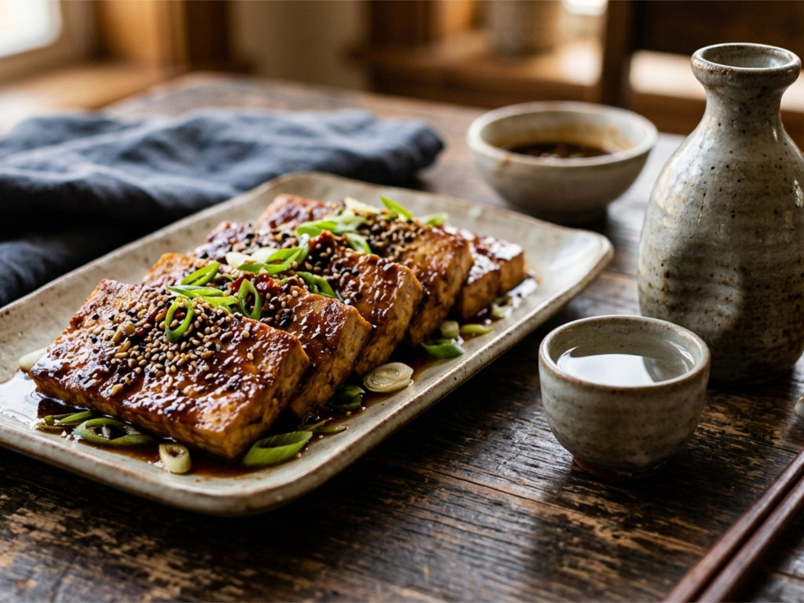

# 배 마늘 간장 두부 조림

> ⏱️ 조리시간: 13분 | 🍽️ 1인분 | 난이도: ⭐ 쉬움 | 🔥 약 280kcal

## 📝 재료

**필수 재료**
- 두부 (부침용) — 1/2모 (150g)
- 배 — 1/6개 (약 60g, 강판에 갈거나 작게 다짐)
- 마늘 — 3쪽 (다짐)

**양념 (기본 보유 재료)**
- 간장 — 2큰술
- 설탕 — 1/2작은술
- 식용유 — 1큰술
- 후추 — 약간

**선택 재료**
- 참기름 — 1/2작은술
- 통깨 — 약간
- 고춧가루 — 1/2작은술 (매콤하게 원할 때)

## 👨‍🍳 만드는 법

1. **두부 준비**: 두부를 1cm 두께로 납작하게 썰고, 키친타월로 꾹 눌러 물기를 제거한다.

2. **양념장 만들기**: 작은 그릇에 간장 2큰술, 다진 마늘, 설탕 1/2작은술, 후추를 섞어둔다. 배는 강판에 갈아 2큰술 분량을 양념장에 함께 넣는다. (배즙이 고기 연화제 역할을 해서 두부가 부드럽게 돼요!)

3. **두부 굽기**: 프라이팬에 식용유를 두르고 중강불로 달군 뒤, 두부를 넣어 앞뒤 각 2분씩 노릇하게 굽는다.

4. **양념 붓기**: 구운 두부 위에 양념장을 고루 붓고, 중약불로 줄인 뒤 1~2분간 조린다. 중간에 한 번 뒤집어 주면 양념이 골고루 배어요.

5. **마무리**: 불을 끄고 참기름과 통깨를 뿌리면 완성! 밥 위에 올려 덮밥으로 먹어도 맛있어요.

## 💡 꿀팁

- **설거지 최소화**: 양념장을 두부 포장 용기에 바로 섞으면 그릇을 따로 쓸 필요가 없어요.
- **배가 없다면**: 사과 1/8개나 키위 반 개로 대체 가능해요. 단맛과 연육 효과는 비슷해요.
- **더 깊은 맛**: 조림 중 물 2큰술을 추가하면 양념이 두부 속까지 잘 스며들어요.
- **보관**: 냉장 보관 시 다음 날도 맛있게 먹을 수 있어요. (2일 이내 소비 권장)
- **응용**: 방울토마토를 함께 넣으면 새콤달콤한 맛이 더해져요!

## 🔥 칼로리 정보
| 재료 | 칼로리 |
|------|--------|
| 두부 1/2모 (150g) | 약 120kcal |
| 배 1/6개 (60g) | 약 30kcal |
| 마늘 3쪽 | 약 10kcal |
| 간장 2큰술 | 약 20kcal |
| 식용유 1큰술 | 약 45kcal |
| 설탕 1/2작은술 | 약 8kcal |
| 참기름 1/2작은술 | 약 20kcal |
| **합계** | **약 280kcal** |

## 🍺 페어링 추천
- **청주/사케**: 차갑게 칠링한 청주 — 간장 조림의 감칠맛과 청주의 은은한 단맛이 환상 조합이에요!
- **맥주**: 일본식 라거 (아사히, 삿포로) — 깔끔한 라거가 짭조름한 조림과 잘 맞아요.
- **소주**: 처음처럼 — 간장 두부 조림엔 역시 소주 한 잔, 한국식 반주의 정석이죠.
- **비알콜**: 따뜻한 보리차 — 조림의 짠맛을 부드럽게 중화시켜줘요.
