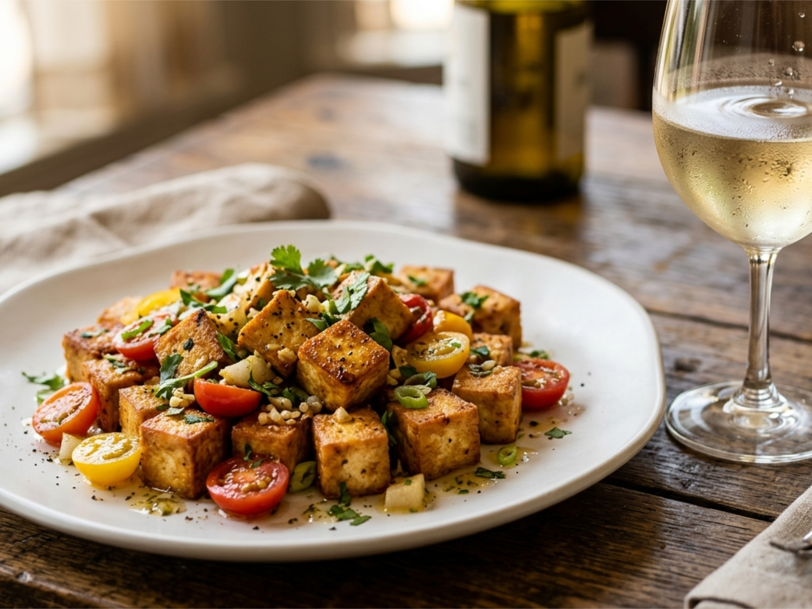

# 두부 방울토마토 마늘 볶음 (배 드레싱)

> ⏱️ 조리시간: 12분 | 🍽️ 1인분 | 난이도: ⭐ 쉬움 | 🔥 약 290kcal

## 📝 재료
- 두부 (단단한 것) — 1/2모 (150g)
- 방울토마토 — 10개
- 마늘 — 3쪽
- 배 — 1/4개
- 간장 — 1큰술
- 설탕 — 1/2작은술
- 식용유 — 1큰술
- 소금, 후추 — 약간

## 👨‍🍳 만드는 법
1. 두부는 키친타월로 물기를 가볍게 눌러 닦은 뒤, 먹기 좋은 크기로 깍둑썰기 합니다 (약 2cm).
2. 마늘은 편으로 얇게 썰고, 방울토마토는 반으로 자릅니다.
3. 배는 강판에 갈거나 잘게 다져서 즙을 냅니다. 간장, 설탕과 섞어 드레싱을 만들어 둡니다.
4. 팬에 식용유를 두르고 중강불로 달궈 두부를 넣고 앞뒤로 노릇하게 구워줍니다 (약 3~4분).
5. 두부가 황금빛이 되면 마늘을 넣고 향이 올라올 때까지 30초간 볶습니다.
6. 방울토마토를 넣고 살짝 숨이 죽을 때까지 1분간 볶아줍니다.
7. 불을 끄고 미리 만들어 둔 배 드레싱을 고루 뿌려 마무리합니다. 소금, 후추로 간을 맞추세요.

## 💡 꿀팁
- 두부 물기를 잘 제거할수록 튀김이 튀지 않고 더 바삭하게 구워져요!
- 팬 하나로 완성되는 요리라 설거지가 최소화돼요. 드레싱은 그릇 하나에 바로 섞으면 끝!
- 배가 없다면 사과즙이나 키위즙으로 대체해도 고기 없이도 부드러운 감칠맛을 낼 수 있어요.
- 방울토마토 대신 일반 토마토 1/2개를 깍둑썰기해 사용해도 됩니다.
- 두부는 부침두부보다 단단한 두부(찌개용)를 쓰면 볶을 때 부서지지 않아요.

## 🔥 칼로리 정보
| 재료 | 칼로리 |
|------|--------|
| 두부 1/2모 (150g) | 약 120kcal |
| 방울토마토 10개 | 약 25kcal |
| 마늘 3쪽 | 약 10kcal |
| 배 1/4개 | 약 45kcal |
| 간장 1큰술 | 약 10kcal |
| 식용유 1큰술 | 약 45kcal |
| 설탕 1/2작은술 | 약 8kcal |
| **합계** | **약 290kcal** |

## 🍺 페어링 추천
- **화이트 와인**: 리슬링 — 배 드레싱의 과일 풍미와 리슬링의 은은한 단맛이 절묘하게 어울려요!
- **맥주**: 페일에일 (IPA) — 홉의 씁쓸함이 배 드레싱의 달콤함과 좋은 대비를 만들어요.
- **하이볼**: 배 하이볼 — 배 드레싱 요리니까 배 하이볼과 완벽한 통일감!
- **비알콜**: 배즙 또는 배 탄산수 — 요리의 배 풍미를 더 풍성하게 즐길 수 있어요.
