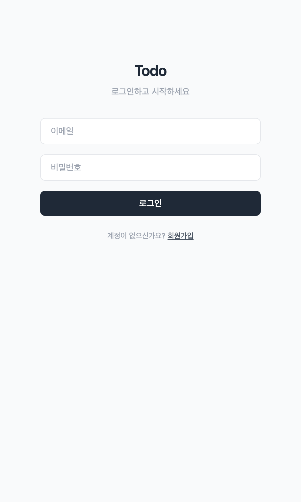
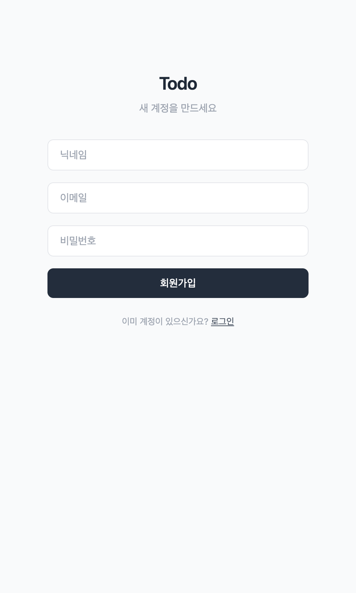
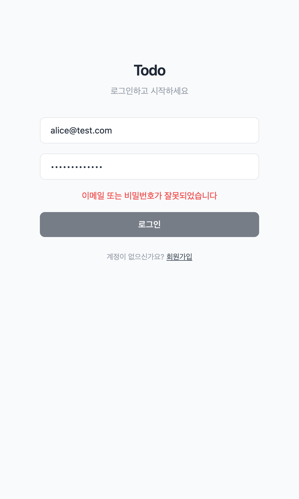
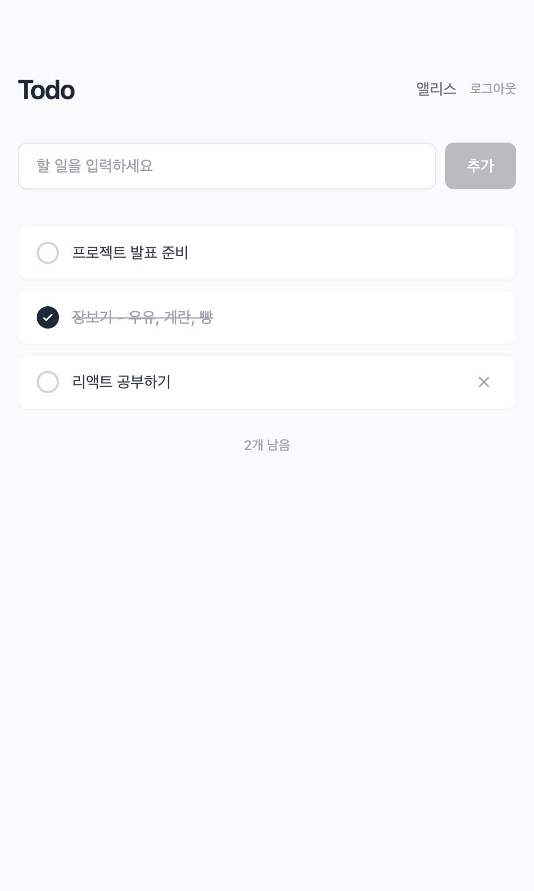
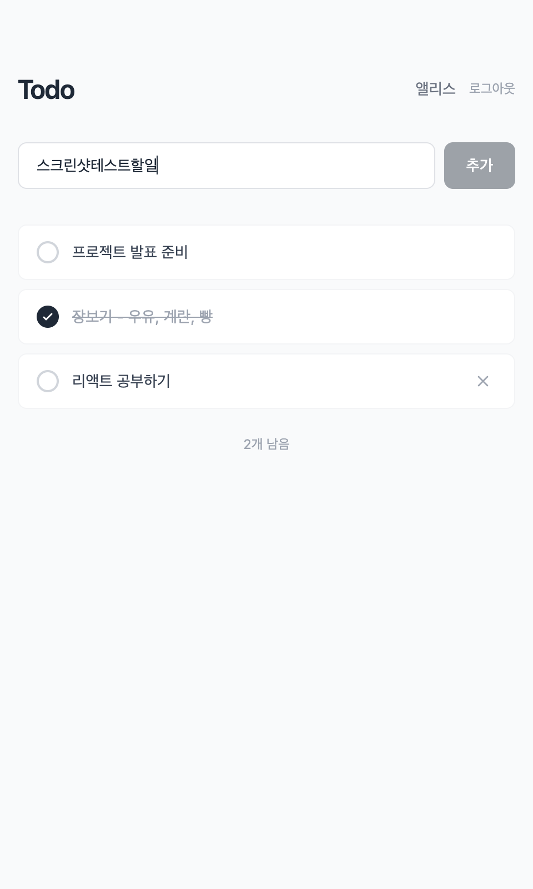
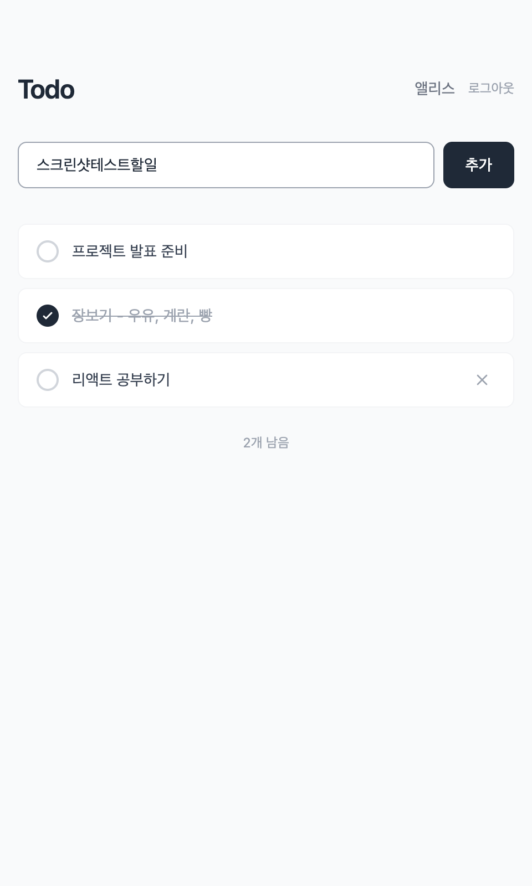
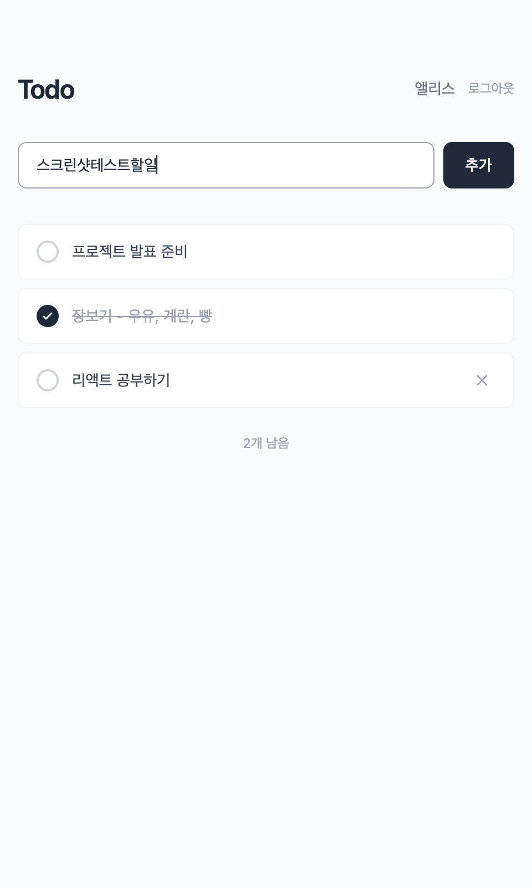
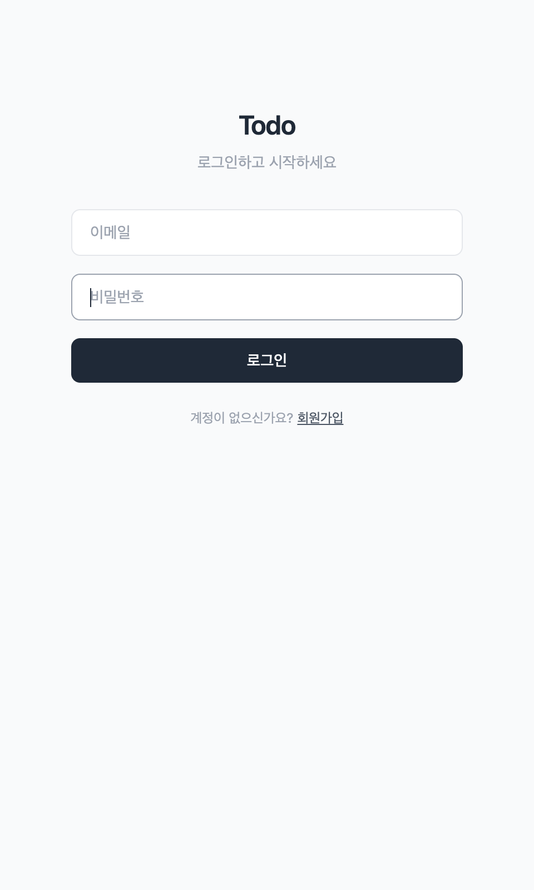
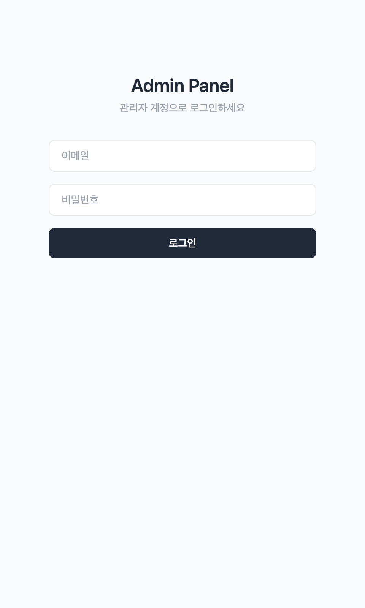

# Todo App 기능 테스트 리포트

**테스트 일시:** 2026-04-14
**테스트 환경:** localhost:3001 (Node.js + Express + PostgreSQL)

---

## 1. 인증 기능

### 1-1. 로그인 화면
- **결과:** PASS
- 이메일, 비밀번호 입력 필드 정상 표시
- 회원가입 전환 링크 동작 확인



### 1-2. 회원가입 화면
- **결과:** PASS
- 닉네임, 이메일, 비밀번호 3개 필드 정상 표시
- 로그인 전환 링크 동작 확인



### 1-3. 회원가입 API
- **결과:** PASS
- 요청: `POST /api/auth/signup` (`test_claude@test.com`)
- 응답: `201 Created`, JWT 토큰 + 유저 정보 반환

```json
{
  "success": true,
  "data": {
    "token": "eyJhbG...",
    "user": { "id": 10, "email": "test_claude@test.com", "nickname": "클로드테스터", "role": "user" }
  }
}
```

### 1-4. 중복 회원가입 방지
- **결과:** PASS
- 이미 존재하는 이메일로 가입 시도 → `409 Conflict`
- 메시지: "이미 가입된 이메일입니다"

### 1-5. 로그인 성공
- **결과:** PASS
- 요청: `POST /api/auth/login` (`alice@test.com` / `1234`)
- 응답: `200 OK`, JWT 토큰 + 유저 정보 반환

### 1-6. 로그인 실패 (잘못된 비밀번호)
- **결과:** PASS
- 요청: `POST /api/auth/login` (잘못된 비밀번호)
- 응답: `401 Unauthorized`, "이메일 또는 비밀번호가 잘못되었습니다"
- UI에 빨간색 에러 메시지 정상 표시



### 1-7. 인증 없이 API 접근
- **결과:** PASS
- 토큰 없이 `GET /api/todos` 요청 → `401 Unauthorized`
- 메시지: "로그인이 필요합니다"

---

## 2. 할일 CRUD 기능

### 2-1. 할일 목록 조회
- **결과:** PASS
- 요청: `GET /api/todos` (alice 계정)
- 로그인한 유저의 할일만 조회됨 (3개)
- 최신순 정렬 확인



### 2-2. 할일 추가
- **결과:** PASS
- 요청: `POST /api/todos` (`{"text": "API 테스트 할일 추가"}`)
- 응답: `201 Created`, 새 할일 반환 (done: false)
- UI에서 입력 후 추가 버튼 클릭 시 목록에 반영




### 2-3. 할일 완료 토글
- **결과:** PASS
- 요청: `PATCH /api/todos/:id` (`{"done": true}`)
- 응답: `200 OK`, done 값 변경 확인
- UI에서 체크 표시 및 취소선 정상 적용



### 2-4. 할일 삭제
- **결과:** PASS
- 요청: `DELETE /api/todos/:id`
- 응답: `200 OK`, 삭제된 항목 반환
- 다른 유저의 할일은 삭제 불가 (user_id 검증)

---

## 3. 관리자 기능

### 3-1. 관리자 로그인
- **결과:** PASS
- 관리자 계정(`keumbi.noh@gmail.com`)으로 로그인
- Todo 화면에 "관리자" 버튼 표시



### 3-2. 관리자 페이지 (Admin Panel)
- **결과:** PASS
- `/admin.html` 별도 관리자 페이지 존재
- 관리자 계정으로 로그인 필요



### 3-3. 전체 유저 조회 (관리자)
- **결과:** PASS
- 요청: `GET /api/admin/users`
- 전체 유저 4명 조회 (슈퍼관리자, 앨리스, 밥, 클로드테스터)
- 이메일, 닉네임, 역할, 가입일 포함

```json
[
  { "id": 10, "email": "test_claude@test.com", "nickname": "클로드테스터", "role": "user" },
  { "id": 9, "email": "bob@test.com", "nickname": "밥", "role": "user" },
  { "id": 8, "email": "alice@test.com", "nickname": "앨리스", "role": "user" },
  { "id": 7, "email": "keumbi.noh@gmail.com", "nickname": "슈퍼관리자", "role": "admin" }
]
```

### 3-4. 전체 할일 조회 (관리자)
- **결과:** PASS
- 요청: `GET /api/admin/todos`
- 모든 유저의 할일 6개 조회 (유저별 이메일, 닉네임 포함)

---

## 4. 테스트 요약

| 기능 | 항목 | 결과 |
|------|------|------|
| 인증 | 로그인 화면 | PASS |
| 인증 | 회원가입 화면 | PASS |
| 인증 | 회원가입 API | PASS |
| 인증 | 중복 회원가입 방지 | PASS |
| 인증 | 로그인 성공 | PASS |
| 인증 | 로그인 실패 | PASS |
| 인증 | 비인증 접근 차단 | PASS |
| 할일 | 목록 조회 | PASS |
| 할일 | 추가 | PASS |
| 할일 | 완료 토글 | PASS |
| 할일 | 삭제 | PASS |
| 관리자 | 관리자 로그인 | PASS |
| 관리자 | 관리자 페이지 | PASS |
| 관리자 | 전체 유저 조회 | PASS |
| 관리자 | 전체 할일 조회 | PASS |

**총 15개 항목 테스트 → 전체 PASS**
